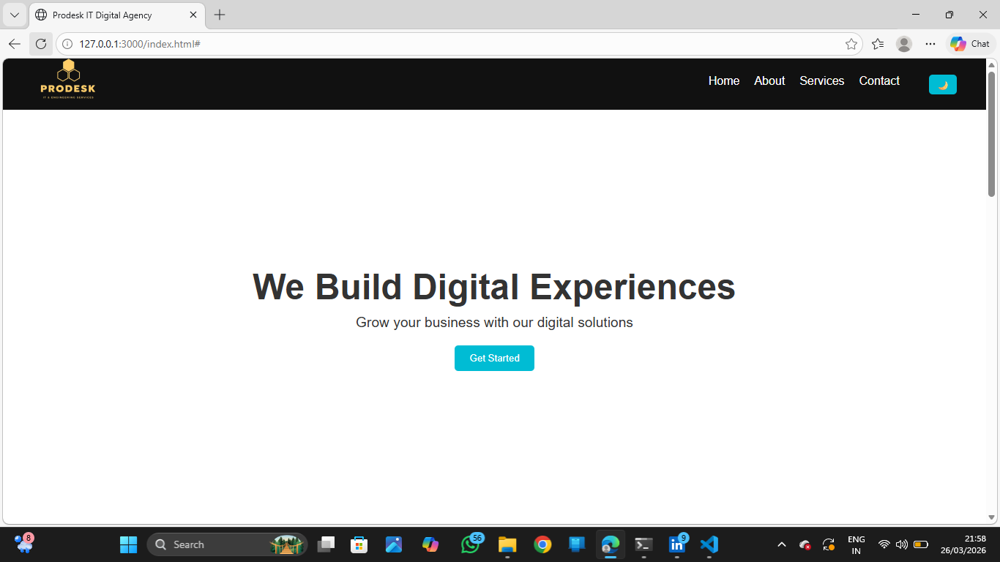
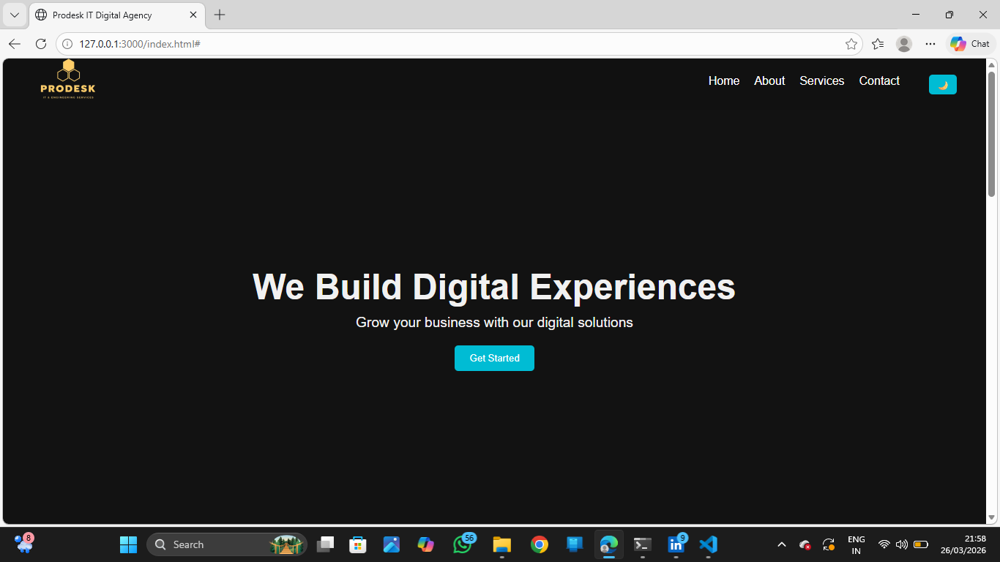
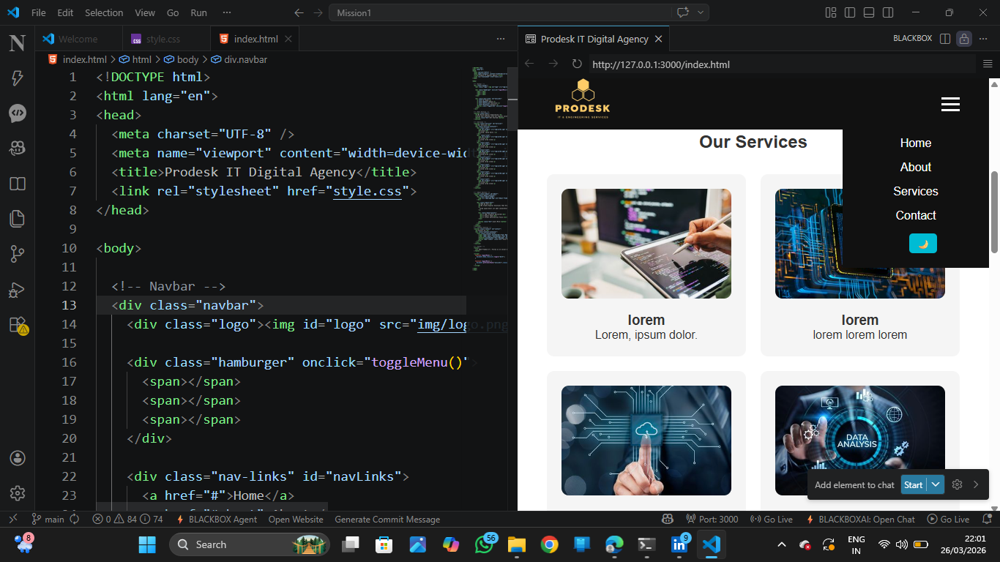
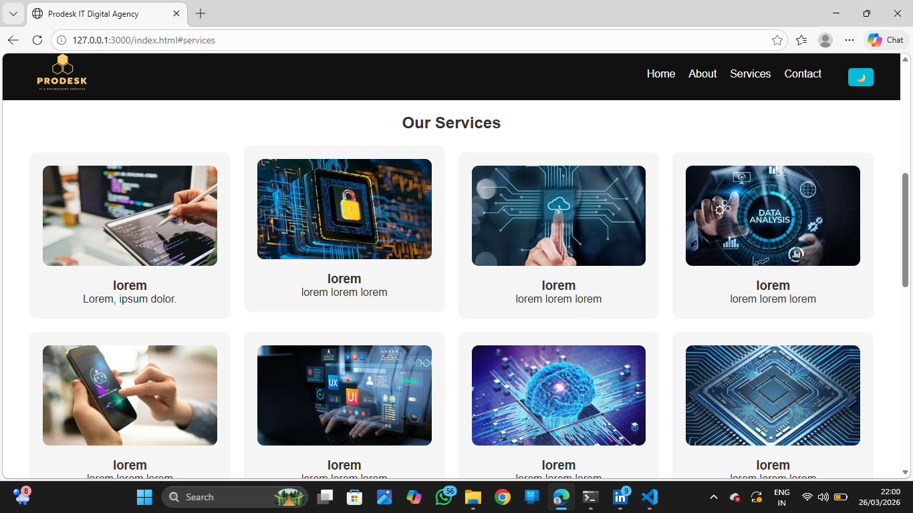
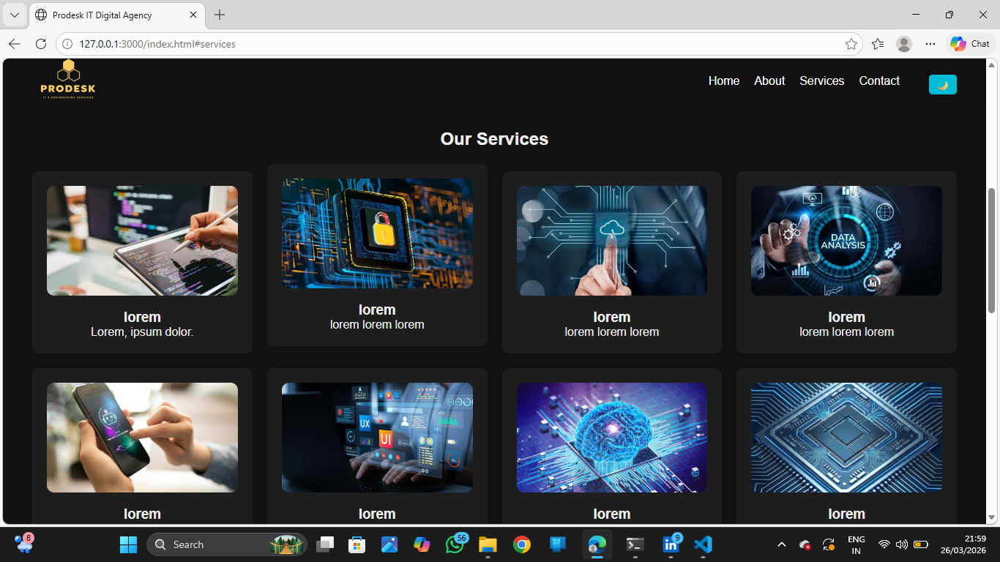
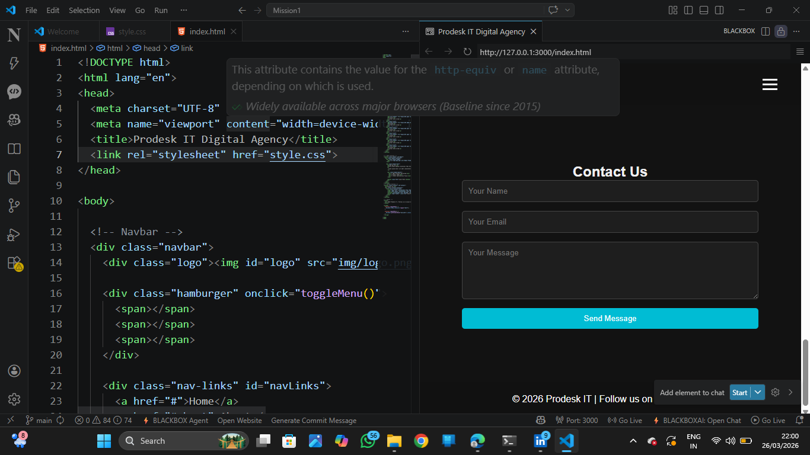

# 🚀 Prodesk IT Digital Agency

A modern and responsive landing page for a fictional digital agency built using HTML, CSS, and JavaScript.

---

## 🌐 Live Demo
👉 https://aryan-webdeveloper.github.io/prodesk-it-website/

---

## 📸 Screenshot

---

## 📌 Features

- Responsive Design (Mobile + Desktop)
- Hamburger Menu for Mobile
- Dark Mode Toggle
- Sticky Navbar
- Services Grid Layout
- About & Contact Sections
- Hover Animations

---

## 🛠️ Tech Stack

- HTML5
- CSS3 (Flexbox + Grid)
- JavaScript

---

## 📂 Project Structure

prodesk-it-website/
│
├── index.html
├── style.css
├── img/
├── README.md
└── Prompts.md

---

## 🚀 Deployment

Deployed using GitHub Pages.

---

## 👨‍💻 Author

Aryan  
GitHub: https://github.com/ARYAN-WEBDEVELOPER
